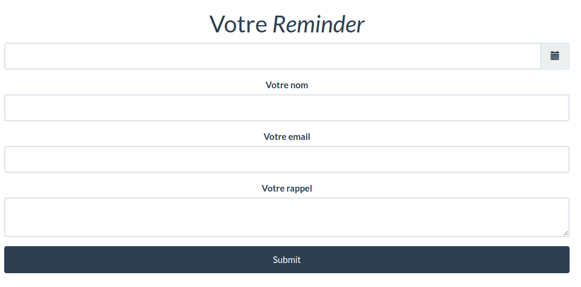

# Projet Reminder

Application qui a pour but de programmer des rappels par mail avec l'API Sendinblue. 
Les rappels sont trigger via un CRON linux se qui déclenche l'envoi du/des mails en BDD.


## Installation

```bash
git clone <project_name>
composer i
```

## Paramétrage du CRON sur Linux

- Ouvrir le CRON `crontab - e`
- Ajouter au fichier la ligne suivante
```
* * * * * /usr/bin/php /var/www/html/reminder/bin/console app:send-mail 2>&1 | logger -t mycmd
```

## Problèmes rencontrés

- Datetime valeur de retour du datetimepicker de bootstrap non-compatible avec Symfo : solution trouvé => https://github.com/symfony/symfony/issues/28703

## Notes

- Pour avoir le CSS du datepicker fonctionnel, il faut prendre la *version 3* de bootstrap

https://getdatepicker.com/4/


